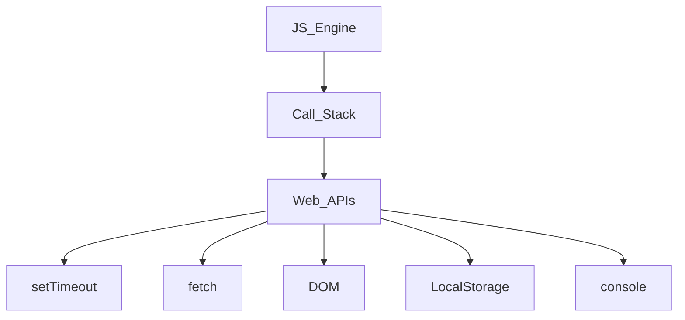
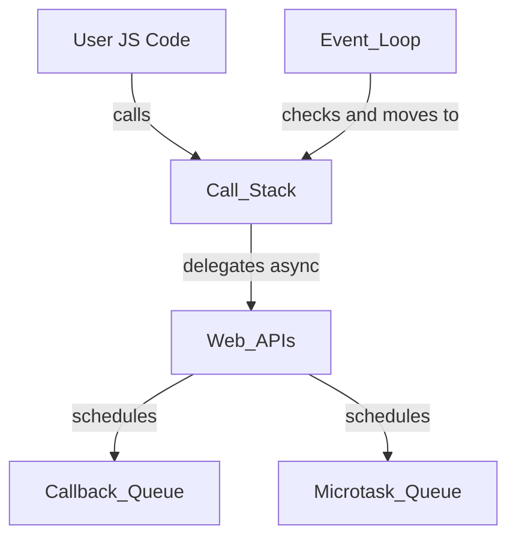

# 🎬 Episode 15: Asynchronous JavaScript & Event Loop 🔄

> 🧠 **Core Idea**: _Time, tide, and JavaScript wait for none!_  
> 📌 **Note**: The **Call Stack** executes any **execution context** that enters it. But it doesn’t have a timer!

---

## 🧩 JavaScript Runtime & Browser Environment

### 🛠️ JavaScript Engine Contains:
- **Call Stack** 📚: Handles Global & Local Execution Contexts.

### 🌐 Browser Gives Extra Superpowers:
- ✅ Timers (`setTimeout`)
- ✅ DOM Access (`document`)
- ✅ `fetch` API
- ✅ LocalStorage
- ✅ `console`, `location`, `geolocation`, `Bluetooth`, etc.

> 🔗 These features are provided via **Web APIs** – **not part of JavaScript itself!**

---

## 🔌 How JS Talks to These Superpowers

**Call Stack ↔️ Web APIs ↔️ Browser Features**



> ✅ All these APIs are accessed via the `window` object:
```js
window.setTimeout()
window.console.log()
window.localStorage
```
> ⚠️ But since `window` is the global object, we often skip writing it explicitly.

---

## 💡 Example: Simple Asynchronous Flow

```js
console.log("start");

setTimeout(function cb() {
  console.log("timer");
}, 5000);

console.log("end");
```

🧠 **Explanation**:
1. `GEC` (Global Execution Context) is pushed to the **Call Stack**.
2. `console.log("start")` → Call Web API → Print in console.
3. `setTimeout(cb, 5000)` → Registered in **Web API** with 5s timer; callback stored.
4. `console.log("end")` → Call Web API → Print in console.
5. After 5s, `cb()` goes to **Callback Queue**.
6. **Event Loop** monitors → if **Call Stack** is empty ➡️ moves `cb()` to Call Stack.

---

## 🌀 Event Loop & Queues: The Real Heroes

### 🕵️‍♂️ Event Loop
- Continuously checks the **Call Stack** and **Queues**.
- If **Call Stack is empty**, it pulls from:
  1. **Microtask Queue** (🔼 High Priority)
  2. **Callback Queue / Macrotask Queue** (🔽 Low Priority)

### 📥 Callback Queue (Macrotasks)
- `setTimeout`, `setInterval`, `DOM events`, etc.

### 🧾 Microtask Queue
- `Promise.then()`, `MutationObserver`.

> ⚠️ If Microtask Queue keeps adding more microtasks, Callback Queue may **never execute** → 🔁 **Starvation**.

---

## 📚 Code Example: Microtasks vs Macrotasks

```js
console.log("Start");

setTimeout(function cbT() {
  console.log("CB Timeout");
}, 5000);

fetch("https://api.netflix.com")
  .then(function cbF() {
    console.log("CB Netflix");
  });

console.log("End");
```

### 🔍 Explanation:
1. `console.log("Start")` → Printed.
2. `setTimeout(cbT, 5000)` → cbT stored in Web API.
3. `fetch(...)` → cbF stored in Web API, response in 2s.
4. `console.log("End")` → Printed.
5. After 2s → cbF → Microtask Queue.
6. After 5s → cbT → Callback Queue.
7. **Event Loop**:
   - ✅ cbF (Microtask) → Executes first: `"CB Netflix"`
   - ✅ cbT (Callback) → Executes next: `"CB Timeout"`

---

## 🔎 Event Listener Example

```js
document.getElementById("btn").addEventListener("click", function cb() {
  console.log("Button Clicked");
});
```

- Callback `cb()` is **registered** in Web API.
- Remains **dormant** until event happens.
- ⚠️ **Stays in memory** unless removed → leads to memory leaks!

---

## 🧠 FAQs & Deep Insights

### ❓When does the Event Loop start?
- 🔁 It runs **forever** in a loop checking queues.

### ❓Do synchronous callbacks go to Web API?
- ❌ No. Only **asynchronous** callbacks (like `setTimeout`, `fetch`, event listeners) are registered in the Web API.

### ❓Does Web API store callbacks?
- ✅ Yes. Stores them and schedules them in **queues** after the async action is complete.

### ❓What happens with `setTimeout(..., 0)`?
- ⌛ Even with 0ms, callback waits for **Call Stack to empty**.
- Could take 100ms or more in a busy stack — due to **trust issues**! 😅

---

## 🎯 Summary Table

| Component         | What It Does                                | Example Use                      |
|------------------|---------------------------------------------|----------------------------------|
| Call Stack        | Executes functions                         | `function call`                  |
| Web API           | Browser features interface                 | `setTimeout`, `fetch`, `DOM`    |
| Callback Queue    | Stores macrotasks                          | `setTimeout`, `event listeners` |
| Microtask Queue   | Stores microtasks (priority)               | `Promise.then()`, `MutationObserver` |
| Event Loop        | Moves tasks to Call Stack when it's empty  | N/A                              |

---

## 🔚 Final Thought

> 🧵 JavaScript is **single-threaded**, but thanks to **event loop & queues**, it handles async tasks like a pro!  
> Understanding how **Call Stack**, **Web APIs**, **Queues**, and the **Event Loop** work together is key to writing efficient, non-blocking JS code. 🚀

---

## 🌐 Web APIs: The Browser’s Secret Sauce 🍯

> 🧠 **What Are Web APIs?**  
> Web APIs are **browser-provided interfaces** that extend the capabilities of JavaScript beyond what the language itself can do.  
> 📌 They are **not part of the JavaScript engine** (like V8 or SpiderMonkey) but are made available by the **browser environment**.

### 🧰 Types of Web APIs

| Category          | Web API Examples                          | Purpose                                       |
|------------------|-------------------------------------------|-----------------------------------------------|
| **Timing**        | `setTimeout()`, `setInterval()`           | Delayed or repeated execution                 |
| **Network**       | `fetch()`, `XMLHttpRequest`               | Make HTTP requests                           |
| **DOM**           | `document`, `getElementById()`, etc.      | Interact with HTML elements                   |
| **Storage**       | `localStorage`, `sessionStorage`, `cookies` | Store data in the browser                     |
| **Multimedia**    | `Audio`, `Video`, `Canvas`, `WebGL`       | Handle graphics, audio, video                 |
| **Geolocation**   | `navigator.geolocation`                   | Get the user's physical location              |
| **Device Access** | `Bluetooth`, `Battery API`, `Clipboard`   | Communicate with hardware-level features      |
| **Worker Threads**| `Web Workers`, `Service Workers`          | Run JS in background threads (limited scope)  |

### ⚙️ How They Work

- When you call a function like `setTimeout()` or `fetch()`:
  - The **JavaScript engine** delegates it to the **browser’s Web API layer**.
  - The browser handles the task asynchronously (e.g., starting a timer, making a network request).
  - Once complete, it registers the callback in the appropriate **queue** (Microtask or Callback).
  - The **Event Loop** then pushes it to the Call Stack **when it’s safe to do so**.

> 📦 These APIs are globally accessible via the `window` object (in browsers), so you can call them directly.

---

### 🔄 Diagram Update Suggestion

To clarify how Web APIs fit into the bigger picture, you could also include:



---

### 🚫 JavaScript Does *Not* Have:
- Native support for **timing**, **networking**, or **DOM manipulation**.
- These come from **Web APIs** provided by the browser or **Node APIs** in server-side environments.

---

## 🌍 Web APIs vs 🌐 Node.js APIs

> 🧠 While **JavaScript is the language**, its capabilities **depend on the environment** it's running in.  
> - 🖥 In the **browser**, you interact with **Web APIs**.
> - 🛠 In **Node.js**, you interact with **Node APIs**.

---

### 🧭 Comparison Table

| Feature / API Type       | Web APIs (Browser)                       | Node.js APIs (Backend)                         |
|--------------------------|------------------------------------------|------------------------------------------------|
| **Environment**          | Runs in browser (Chrome, Firefox, etc.) | Runs in server-side (Node.js runtime)          |
| **Timer APIs**           | `setTimeout`, `setInterval`             | Same                                            |
| **Network APIs**         | `fetch`, `XMLHttpRequest`               | `http`, `https`, `axios`, `node-fetch`         |
| **DOM Manipulation**     | ✅ Yes (`document`, `window`)           | ❌ Not available (no DOM in Node)               |
| **Storage APIs**         | `localStorage`, `sessionStorage`        | `fs` (file system module), `path`, `os`        |
| **File Access**          | ❌ Not allowed (for security reasons)    | ✅ Full access via `fs`                         |
| **Multithreading**       | Web Workers, Service Workers            | Worker Threads, `cluster` module               |
| **WebSockets**           | `WebSocket` API                         | `ws` library, `socket.io`                      |
| **Fetch API**            | Native in most browsers                 | Needs polyfill like `node-fetch`, `axios`      |
| **Global Object**        | `window`                                | `global`, `globalThis`, `process`              |
| **Event Loop**           | Present, same core model                | Present, same core model                       |

---

### 🧪 Example Difference

**Browser:**
```js
fetch('https://api.example.com/data')
  .then(res => res.json())
  .then(console.log);
```

**Node.js:**
```js
const fetch = require('node-fetch');

fetch('https://api.example.com/data')
  .then(res => res.json())
  .then(console.log);
```

> ✅ Even though `fetch()` is a Web API, we can use it in Node by **importing a library**.

---

### 🧠 Key Takeaway

> JavaScript is like a **driver’s license**.  
> What you can "drive" (use) depends on whether you're in a **browser (Web APIs)** or on the **server (Node.js APIs)**.  
> But the core engine—the **event loop, call stack, and queues**—is shared in both!

---

## 🧪 JavaScript Code: Full Async Process Flow

```js
console.log("🟢 Script Start");

setTimeout(() => {
  console.log("⏲️ setTimeout (Macrotask)");
}, 0);

Promise.resolve().then(() => {
  console.log("⚡ Promise 1 (Microtask)");
});

fetch("https://jsonplaceholder.typicode.com/todos/1")
  .then(() => {
    console.log("🌐 fetch (Microtask after response)");
  });

Promise.resolve().then(() => {
  console.log("⚡ Promise 2 (Microtask)");
});

console.log("🔴 Script End");
```

---

## 🔍 Step-by-Step Process:

1. **Call Stack** starts running the synchronous code:
   - Prints `🟢 Script Start`
   - Registers `setTimeout()` in **Web API**
   - Registers `.then()` of Promises and `fetch()` response callbacks in **Web APIs** / **Microtask Queue**
   - Prints `🔴 Script End`

2. After main thread completes:
   - **Microtask Queue**:
     - ✅ `Promise 1 → ⚡ Promise 1`
     - ✅ `Promise 2 → ⚡ Promise 2`
     - ✅ `fetch.then() → 🌐 fetch`
   - All run **before any macrotask**.

3. Finally:
   - **Macrotask Queue** (`setTimeout`) is handled:
     - ✅ `⏲️ setTimeout`

---

## 🧠 Final Output Order:

```
🟢 Script Start
🔴 Script End
⚡ Promise 1 (Microtask)
⚡ Promise 2 (Microtask)
🌐 fetch (Microtask after response)
⏲️ setTimeout (Macrotask)
```

---

## 📌 Explanation Summary:

| Task Source        | Queue               | Priority |
|--------------------|---------------------|----------|
| `console.log`      | Call Stack          | Immediate |
| `setTimeout`       | Web API → Macrotask | 🔽 Low |
| `Promise.then()`   | Microtask Queue     | 🔼 High |
| `fetch().then()`   | Microtask Queue     | 🔼 High (after Web API resolves) |

---

## 🧾 **Types of Callback Queues in JavaScript**

### 1. 🧠 **Microtask Queue** (High Priority)
These are **executed immediately** after the current execution completes and **before** any macrotask.

- ✅ `Promise.then()`, `Promise.catch()`, `Promise.finally()`
- ✅ `queueMicrotask()`
- ✅ `MutationObserver`

📌 **Key Rule**: After every task (sync or async), **all microtasks are drained** before the next macrotask.

---

### 2. ⏱️ **Macrotask Queue** (Callback Queue)
Also called the **task queue**, it's used for scheduling tasks that should run after the current code and microtasks complete.

- ✅ `setTimeout()`
- ✅ `setInterval()`
- ✅ `setImmediate()` (Node.js)
- ✅ `I/O callbacks` (like file reads)
- ✅ `UI rendering`, `event listeners`

📌 **Order of Execution**:
1. Call Stack finishes current execution
2. Run **all Microtasks**
3. Pick the **first Macrotask**

---

## 🌀 Event Loop Priority Order:
```plaintext
1. Call Stack
2. Microtask Queue (Promises, MutationObserver)
3. Macrotask Queue (setTimeout, setInterval, DOM Events)
```

---

### 🔁 Visual Analogy

| Queue Type       | Priority | Examples                           | Execution Timing              |
|------------------|----------|------------------------------------|-------------------------------|
| **Microtask**     | 🔼 High   | `Promise.then()`, `queueMicrotask()` | Immediately after current task |
| **Macrotask**     | 🔽 Low    | `setTimeout()`, `setInterval()`    | After microtasks are cleared  |

---
### 🌑 **Starvation in JavaScript (Event Loop)**

> 🧠 **Starvation** occurs when **low-priority tasks** (like macrotasks) never get a chance to execute because **high-priority tasks** (like microtasks) keep the event loop busy indefinitely.

---

### 🔄 What Causes Starvation?

- **Microtask Queue** has **higher priority** than the **Macrotask (Callback) Queue**.
- If new microtasks are constantly added (e.g., inside `.then()`), they keep executing before any macrotasks.
- Macrotasks like `setTimeout`, `setInterval`, `DOM events` get **"starved"**.

---

### 🧪 Example: Microtask Starvation

```js
setTimeout(() => {
  console.log("Macrotask - Timeout");
}, 0);

function runMicrotask() {
  Promise.resolve().then(() => {
    console.log("Microtask");
    runMicrotask(); // Recursively adds a new microtask
  });
}

runMicrotask();
```

### 🧵 What Happens:
- `setTimeout` registers a **macrotask**.
- `runMicrotask()` creates an **infinite chain of microtasks**.
- The **Event Loop** keeps executing microtasks forever.
- ✅ **Call Stack stays empty**, but…
- ❌ **Macrotask never gets a turn** → `Macrotask - Timeout` is never printed.

---

### 🚨 Consequences:
- UI can **freeze**.
- Timers/events appear **non-functional**.
- Can lead to **performance bugs** and **hard-to-debug issues**.

---

### ✅ How to Avoid Starvation:
- Avoid **infinite microtask loops**.
- Break long chains with `setTimeout(..., 0)` or `queueMicrotask()` strategically.
- Monitor async flow carefully in recursive structures.
---

## 🧠 Why Workers?

> JavaScript is **single-threaded**, meaning long tasks (e.g., heavy computations or fetches) can **block** the UI.  
> 💡 **Workers** run JS in **separate threads**, allowing **non-blocking background processing**.

---

## ⚙️ 1. Worker Threads (Node.js) 🖥️

### 💡 Used in: **Node.js (Server-side)**  
> Enables **true multithreading** in Node for CPU-intensive tasks.

### 🔧 Use Case:
- Heavy CPU computations
- Image processing
- Parallel tasks

### 📦 Required Module:
```js
const { Worker, isMainThread, parentPort } = require('worker_threads');
```

### 📁 Code: `worker.js`
```js
const { parentPort } = require('worker_threads');

let sum = 0;
for (let i = 0; i < 1e9; i++) sum += i;

parentPort.postMessage(sum); // 💌 Send result to main thread
```

### 📁 Main Thread: `index.js`
```js
const { Worker } = require('worker_threads');

console.log("🧵 Main thread starting");

const worker = new Worker('./worker.js');

worker.on('message', (msg) => {
  console.log("📥 Received from worker:", msg);
});

console.log("🚀 Main thread continues...");
```

### ✅ Output:
```
🧵 Main thread starting
🚀 Main thread continues...
📥 Received from worker: 499999999500000000
```

---

## 🌐 2. Web Workers (Frontend) 🌍

### 💡 Used in: **Browsers**  
> Allows long-running JS code to run without blocking UI.

### 📁 Code: `worker.js`
```js
self.onmessage = function(e) {
  const num = e.data;
  let result = 1;
  for (let i = 1; i <= num; i++) result *= i;
  postMessage(result); // 💌 Send result to UI thread
};
```

### 📁 Main HTML + JS
```html
<button onclick="calc()">⚙️ Calculate Factorial</button>
<script>
  const worker = new Worker("worker.js");

  worker.onmessage = (e) => {
    alert("✅ Result: " + e.data);
  };

  function calc() {
    const num = parseInt(prompt("Enter number:"));
    worker.postMessage(num); // 📤 Send data to worker
  }
</script>
```

### 🧠 Notes:
- Uses `postMessage()` to **communicate between threads**
- Runs in **separate thread** from the DOM → can't access `document`, `window`, etc.

---

## 📡 3. Service Workers ⚙️📬

### 💡 Used in: **Browsers**  
> Act as a **proxy** between the browser and the network.  
> Handles:
- Caching
- Offline capabilities
- Push notifications
- Background sync

### 🪄 Life Cycle:
1. Register
2. Install
3. Activate
4. Intercept fetch

---

### 📁 Main JS
```js
if ('serviceWorker' in navigator) {
  navigator.serviceWorker.register('sw.js')
    .then(() => console.log("📦 Service Worker registered!"))
    .catch(err => console.error("❌ SW registration failed:", err));
}
```

### 📁 `sw.js`
```js
self.addEventListener('install', event => {
  console.log("📥 Service Worker installed");
});

self.addEventListener('fetch', event => {
  console.log("📡 Intercepting:", event.request.url);
});
```

### 🧠 Notes:
- Runs **even when page is closed** (after activation)
- Useful for **PWA (Progressive Web Apps)**

---

## 🆚 Comparison Table

| Feature           | Worker Threads (Node.js) | Web Workers (Browser) | Service Workers (Browser) |
|------------------|--------------------------|------------------------|----------------------------|
| 🌍 Environment    | Node.js                  | Browser                | Browser                    |
| 🧵 Threaded       | Yes (True threads)       | Yes (Web thread)       | Yes (Background thread)    |
| 🧱 Access to DOM  | ❌                       | ❌                     | ❌                         |
| 📶 Intercept fetch| ❌                       | ❌                     | ✅                         |
| 🔁 Persistent     | ❌ Ends with page        | ❌ Ends with page      | ✅ Stays alive             |
| 📬 Use Case       | CPU Tasks                | UI Performance         | Offline/PWA/Cache/Push     |

---

## 📌 Key Emoji Summary

- 🧵 **Worker Threads** = Multithreading in Node
- 🌍 **Web Workers** = Background JS in browser
- 📡 **Service Workers** = Network proxy for caching, offline
- 💌 `postMessage()` = Communication between threads
- ❌ Can't touch the DOM in workers!

---
